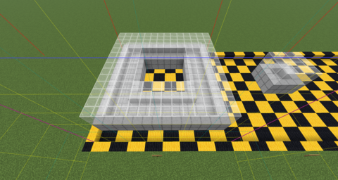
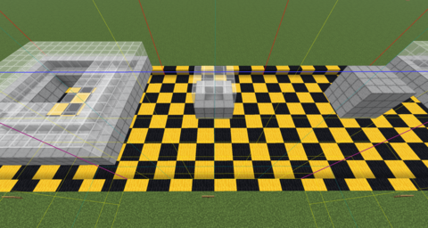
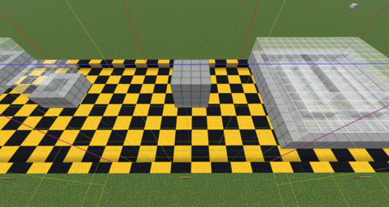
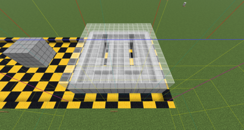

# Examples

## Torus



```bash
$ mc-homology --x 0 16 --y -60 -52 --z 0 16 savefiles/homology-examples/region
[1, 2, 1, 0], [[], [], [], []]
```

## Sphere



```bash
$ mc-homology --x 0 16 --y -60 -52 --z 16 32 savefiles/homology-examples/region
[1, 0, 1, 0], [[], [], [], []]
```

## Ball



```bash
$ mc-homology --x 0 16 --y -60 -52 --z 32 48 savefiles/homology-examples/region
[1, 0, 0, 0], [[], [], [], []]
```

## Double torus



```bash
$ mc-homology --x 0 16 --y -60 -52 --z 48 64 savefiles/homology-examples/region
[1, 4, 1, 0], [[], [], [], []]
```
